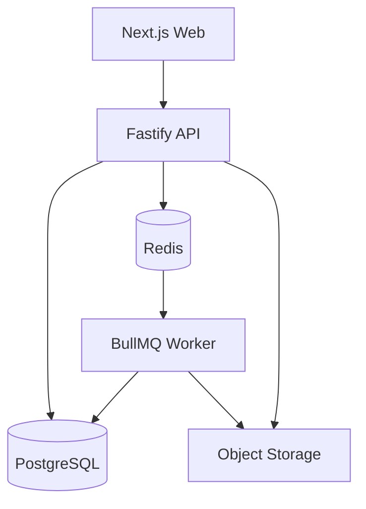
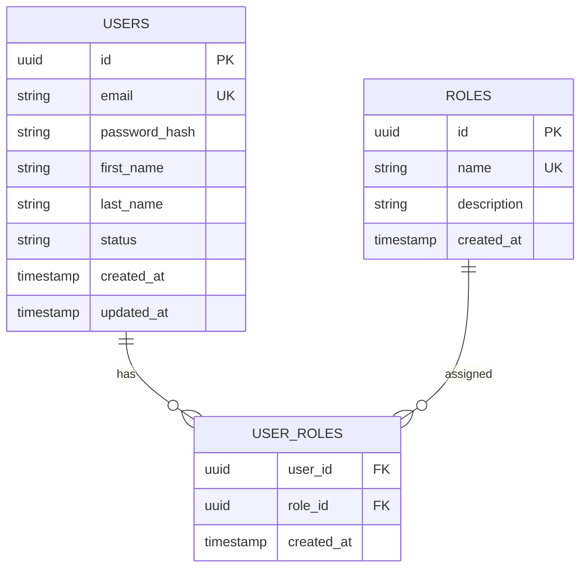

# E-Learning Platform — Phase 1 Implementation Plan

## 1. Phase Overview

### Phase Name

**Phase 1 — Platform Foundation & Architecture**

### Objective

Establish the production-ready technical foundation for the university e-learning platform.

This phase must create a clean, scalable and strongly typed monorepo containing:

- Web application
- Fastify API
- Background worker
- PostgreSQL database
- Redis
- Shared TypeScript packages
- Database migration system
- Docker development environment
- Environment configuration
- Logging
- Error handling
- API versioning
- Health checks
- Testing foundation
- API documentation foundation

No major business functionality should be implemented during this phase.

The purpose of Phase 1 is to create a stable foundation on which all future modules can be built.

---

# 2. Technology Stack

Use the following technologies.

## Frontend

- Next.js
- React
- TypeScript
- Tailwind CSS
- shadcn/ui

## Backend

- Node.js
- Fastify
- TypeScript
- Zod

## Database

- PostgreSQL
- Drizzle ORM
- Drizzle Kit

## Cache / Queue

- Redis
- BullMQ

## Realtime

- WebSocket support through Fastify-compatible WebSocket tooling

## Package Management

- pnpm

## Monorepo

- Turborepo

## Development Environment

- Docker
- Docker Compose

## Code Quality

- ESLint
- Prettier
- TypeScript strict mode

## Testing

- Vitest
- Fastify testing utilities where appropriate

---

# 3. Target Repository Structure

Create the following structure.

```text
e-learning-platform/
│
├── apps/
│   │
│   ├── web/
│   │   ├── app/
│   │   │   ├── layout.tsx
│   │   │   ├── page.tsx
│   │   │   └── globals.css
│   │   │
│   │   ├── components/
│   │   ├── lib/
│   │   ├── hooks/
│   │   ├── stores/
│   │   ├── public/
│   │   ├── next.config.ts
│   │   ├── package.json
│   │   └── tsconfig.json
│   │
│   ├── api/
│   │   ├── src/
│   │   │   ├── app.ts
│   │   │   ├── server.ts
│   │   │   │
│   │   │   ├── config/
│   │   │   │   ├── env.ts
│   │   │   │   ├── database.ts
│   │   │   │   ├── redis.ts
│   │   │   │   └── storage.ts
│   │   │   │
│   │   │   ├── plugins/
│   │   │   │   ├── cors.ts
│   │   │   │   ├── logger.ts
│   │   │   │   ├── rate-limit.ts
│   │   │   │   ├── swagger.ts
│   │   │   │   └── websocket.ts
│   │   │   │
│   │   │   ├── common/
│   │   │   │   ├── errors/
│   │   │   │   ├── types/
│   │   │   │   ├── constants/
│   │   │   │   ├── utils/
│   │   │   │   └── validators/
│   │   │   │
│   │   │   ├── modules/
│   │   │   │
│   │   │   └── routes/
│   │   │       ├── health.routes.ts
│   │   │       └── index.ts
│   │   │
│   │   ├── tests/
│   │   ├── package.json
│   │   └── tsconfig.json
│   │
│   └── worker/
│       ├── src/
│       │   ├── worker.ts
│       │   ├── config/
│       │   ├── queues/
│       │   ├── jobs/
│       │   └── processors/
│       │
│       ├── tests/
│       ├── package.json
│       └── tsconfig.json
│
├── packages/
│   │
│   ├── database/
│   │   ├── src/
│   │   │   ├── schema/
│   │   │   │   └── index.ts
│   │   │   ├── client.ts
│   │   │   └── index.ts
│   │   │
│   │   ├── drizzle.config.ts
│   │   ├── migrations/
│   │   ├── package.json
│   │   └── tsconfig.json
│   │
│   ├── shared/
│   │   ├── src/
│   │   │   ├── types/
│   │   │   ├── constants/
│   │   │   ├── schemas/
│   │   │   └── index.ts
│   │   ├── package.json
│   │   └── tsconfig.json
│   │
│   ├── ui/
│   │   ├── src/
│   │   ├── package.json
│   │   └── tsconfig.json
│   │
│   └── config/
│       ├── eslint/
│       ├── typescript/
│       └── package.json
│
├── infrastructure/
│   ├── docker/
│   ├── nginx/
│   └── scripts/
│
├── docs/
│   ├── architecture.md
│   ├── database.md
│   ├── api.md
│   ├── development.md
│   └── decisions/
│
├── .github/
│   └── workflows/
│       └── ci.yml
│
├── .env.example
├── .gitignore
├── .dockerignore
├── docker-compose.yml
├── package.json
├── pnpm-workspace.yaml
├── turbo.json
├── tsconfig.json
├── eslint.config.mjs
├── prettier.config.mjs
└── README.md
```

Do not add unnecessary directories.

---

# 4. Repository Initialization

Initialize the repository as a pnpm workspace.

Configure Turborepo to manage:

```text
apps/web
apps/api
apps/worker

packages/database
packages/shared
packages/ui
packages/config
```

Root commands should include:

```bash
pnpm dev
pnpm build
pnpm test
pnpm lint
pnpm typecheck
pnpm format
pnpm db:generate
pnpm db:migrate
pnpm db:studio
```

These commands must work from the repository root.

---

# 5. TypeScript Configuration

Use strict TypeScript.

The root configuration must enforce:

```text
strict: true
noImplicitAny: true
noUncheckedIndexedAccess: true
exactOptionalPropertyTypes: true
```

Avoid `any`.

If `any` is absolutely unavoidable, document why it is required.

Use shared TypeScript configuration through:

```text
packages/config/typescript
```

All applications and packages should extend the shared configuration.

---

# 6. Environment Configuration

Create:

```text
.env.example
```

Include configuration categories for:

## Application

```text
NODE_ENV
APP_NAME
APP_URL
API_URL
PORT
```

## PostgreSQL

```text
DATABASE_URL
```

## Redis

```text
REDIS_URL
```

## Object Storage

```text
STORAGE_ENDPOINT
STORAGE_REGION
STORAGE_BUCKET
STORAGE_ACCESS_KEY
STORAGE_SECRET_KEY
```

## Authentication

Prepare placeholders for future authentication:

```text
JWT_ACCESS_SECRET
JWT_REFRESH_SECRET
JWT_ACCESS_EXPIRES_IN
JWT_REFRESH_EXPIRES_IN
```

Do not implement authentication yet.

## AI

Prepare placeholders for future AI providers:

```text
AI_PROVIDER
AI_API_KEY
AI_MODEL
```

Do not implement AI functionality yet.

---

# 7. Environment Validation

Create:

```text
apps/api/src/config/env.ts
```

Use Zod to validate environment variables at application startup.

The API must fail fast if required environment variables are missing or invalid.

Never access environment variables randomly throughout the application.

Instead:

```text
process.env
      ↓
env.ts
      ↓
validated configuration
      ↓
application
```

---

# 8. PostgreSQL Setup

Create PostgreSQL through Docker Compose.

The development database must use:

```text
PostgreSQL
```

Configure:

- database name
- username
- password
- persistent volume
- health check

Do not expose PostgreSQL unnecessarily to external networks.

---

# 9. Drizzle Database Layer

Create the database package:

```text
packages/database
```

It must provide:

```text
database client
database schema
migration system
database utilities
```

Create:

```text
packages/database/src/client.ts
```

The database connection must use the validated `DATABASE_URL`.

Create the initial empty schema structure:

```text
packages/database/src/schema/
```

At this stage, only create the schema organization.

Do not implement the complete university schema yet.

---

# 10. Initial Database Tables

Phase 1 should contain only the minimum foundational tables required for the platform.

Create:

### users

Fields:

```text
id
email
password_hash
first_name
last_name
status
created_at
updated_at
```

### roles

Fields:

```text
id
name
description
created_at
```

### user_roles

Fields:

```text
user_id
role_id
created_at
```

Use UUIDs for primary keys.

Use timestamps consistently.

Add appropriate indexes.

Do not implement the complete student, course or programme schema yet.

Those will be introduced in later phases.

---

# 11. Database Design Principles

Follow these rules:

1. Every table must have a primary key.
2. Use UUID identifiers.
3. Use UTC timestamps.
4. Use foreign keys.
5. Use indexes for foreign keys where appropriate.
6. Use unique constraints for naturally unique values.
7. Do not store JSON for relational data unnecessarily.
8. Do not duplicate data unless there is a documented performance reason.
9. Use database transactions for atomic operations.
10. Never expose database entities directly through API responses.

---

# 12. Redis Setup

Add Redis to Docker Compose.

Redis will eventually be used for:

```text
caching
sessions
rate limiting
presence
WebSocket state
BullMQ
temporary application state
```

Create:

```text
apps/api/src/config/redis.ts
```

and a shared Redis connection strategy.

The worker must use the same Redis infrastructure.

---

# 13. BullMQ Foundation

Create the worker application:

```text
apps/worker
```

Configure BullMQ using Redis.

Create the queue architecture:

```text
queues/
├── pdf.queue.ts
├── video.queue.ts
├── notification.queue.ts
└── ai.queue.ts
```

At Phase 1, these queues do not need full processing logic.

Create basic worker infrastructure capable of receiving jobs.

Add a simple test job:

```text
system.test
```

The test job should successfully enter Redis, be processed by the worker, and complete.

---

# 14. Fastify API Foundation

Create:

```text
apps/api/src/app.ts
apps/api/src/server.ts
```

Separate:

```text
application creation
```

from:

```text
server startup
```

This is important for testing.

The application should support:

```text
GET /api/v1/health
```

Response:

```json
{
  "success": true,
  "service": "api",
  "status": "healthy"
}
```

Create a second endpoint:

```text
GET /api/v1/health/database
```

It must verify database connectivity.

Create:

```text
GET /api/v1/health/redis
```

It must verify Redis connectivity.

---

# 15. API Response Convention

Establish a consistent API response format.

Success:

```json
{
  "success": true,
  "data": {}
}
```

Error:

```json
{
  "success": false,
  "error": {
    "code": "SOME_ERROR_CODE",
    "message": "Human readable message"
  }
}
```

Do not return inconsistent response structures between modules.

---

# 16. Error Handling

Create centralized application errors.

Example categories:

```text
ValidationError
AuthenticationError
AuthorizationError
NotFoundError
ConflictError
DatabaseError
InternalServerError
```

Create a global Fastify error handler.

Never expose:

```text
database stack traces
internal implementation details
secrets
environment variables
```

in production responses.

---

# 17. Logging

Implement structured logging.

Every request should have:

```text
request ID
HTTP method
URL
status code
response time
```

Logs must be suitable for production debugging.

Do not log:

```text
passwords
JWT tokens
API keys
private user data
```

---

# 18. CORS

Configure CORS using environment configuration.

Do not use:

```text
Access-Control-Allow-Origin: *
```

for production.

Allow the configured frontend origin.

---

# 19. Rate Limiting

Add the foundation for API rate limiting.

Initial defaults may be applied globally.

More restrictive limits will later be applied to:

```text
authentication
AI endpoints
file uploads
expensive analytics
```

Do not implement authentication-specific limits yet.

---

# 20. WebSocket Foundation

Add WebSocket support to the API.

Create the conceptual routes:

```text
/ws/classroom
/ws/whiteboard
/ws/chat
```

For Phase 1, these endpoints only need to establish and close connections correctly.

Do not implement classroom functionality yet.

Create clear interfaces so later phases can add:

```text
classroom events
whiteboard events
chat events
presence events
```

---

# 21. Web Application Foundation

Create the Next.js application.

The initial page should be a simple platform health/status landing page.

Do not build:

```text
student dashboard
admin dashboard
course pages
login pages
```

in Phase 1.

Those belong to later phases.

Create the frontend API client foundation:

```text
apps/web/lib/api/
```

It should support:

```text
GET
POST
PUT
PATCH
DELETE
```

without duplicating HTTP logic throughout components.

---

# 22. Shared Package

Create:

```text
packages/shared
```

This package should contain shared:

```text
types
constants
Zod schemas
API contracts
utility types
```

Example:

```text
packages/shared/src/
├── types/
├── constants/
├── schemas/
└── index.ts
```

The web and API applications must be able to import shared definitions.

Avoid duplicating API types between frontend and backend.

---

# 23. UI Package

Create:

```text
packages/ui
```

Configure it so that common UI components can eventually be shared between:

```text
student application
admin application
future faculty application
```

Do not build the complete design system yet.

Create only the basic foundation required for future shadcn/ui components.

---

# 24. Docker Compose

Create a development environment containing:

```text
postgres
redis
api
worker
web
```

The architecture should be:

```text
                 ┌──────────────┐
                 │     Web      │
                 │   Next.js    │
                 └──────┬───────┘
                        │
                        ▼
                 ┌──────────────┐
                 │     API      │
                 │   Fastify    │
                 └───┬──────┬───┘
                     │      │
             ┌───────┘      └────────┐
             ▼                        ▼
      ┌────────────┐           ┌────────────┐
      │ PostgreSQL │           │   Redis    │
      └────────────┘           └─────┬──────┘
                                     │
                                     ▼
                              ┌────────────┐
                              │   Worker   │
                              │  BullMQ    │
                              └────────────┘
```

All services must have appropriate health checks.

---

# 25. Local Development

The following should work after installation:

```bash
pnpm install
pnpm dev
```

The developer should be able to start the entire platform locally.

Provide:

```bash
pnpm db:generate
pnpm db:migrate
```

for database setup.

Provide:

```bash
pnpm db:studio
```

for local database inspection.

---

# 26. Testing Foundation

Set up Vitest.

At minimum create tests for:

### API

```text
health endpoint
database health endpoint
redis health endpoint
error handling
```

### Database

Verify that:

```text
database connection works
migrations work
basic users table exists
roles table exists
user_roles table exists
```

### Worker

Verify:

```text
test job can be queued
worker receives job
worker completes job
```

---

# 27. API Documentation

Add OpenAPI/Swagger support.

The API documentation should be accessible through a development-only endpoint such as:

```text
/api/docs
```

Document:

```text
health endpoints
error responses
basic API conventions
```

Future modules will extend the documentation.

---

# 28. Security Baseline

Implement the following baseline security controls:

- Secure HTTP headers
- CORS restrictions
- Request validation
- Rate limiting foundation
- Input sanitization where required
- No secrets in source code
- Environment variable validation
- Safe error responses
- Request size limits
- File upload limits foundation
- Dependency lockfile
- No unnecessary exposed ports

Do not implement authentication yet.

---

# 29. File Upload Architecture Preparation

Do not implement complete file uploads in Phase 1.

However, establish:

```text
storage.ts
```

with an abstraction such as:

```text
StorageProvider
```

Future implementations can support:

```text
S3
MinIO
Cloudflare R2
AWS S3
```

The application must not directly depend on one storage vendor throughout the codebase.

---

# 30. Architecture Documentation

Create:

```text
docs/architecture.md
```

Document:

1. Overall architecture
2. Monorepo structure
3. Web application
4. API
5. Worker
6. PostgreSQL
7. Redis
8. Object storage
9. WebSockets
10. Future AI layer
11. Security architecture
12. Scaling strategy

Create an architecture diagram using Mermaid.

Example:



---

# 31. Database Documentation

Create:

```text
docs/database.md
```

Document:

- Database naming conventions
- UUID strategy
- Timestamp strategy
- Index strategy
- Foreign keys
- Migration process
- Transaction rules
- Soft-delete policy
- Future schema organization

Include an initial ERD:



---

# 32. Architecture Decision Records

Create:

```text
docs/decisions/
```

Add ADR files for major Phase 1 decisions.

At minimum:

```text
001-modular-monolith.md
002-postgresql-primary-database.md
003-redis-cache-and-queues.md
004-object-storage.md
005-pnpm-turborepo-monorepo.md
006-fastify-api.md
```

Each ADR should contain:

```text
Context
Decision
Reason
Alternatives considered
Consequences
```

---

# 33. README

Create a useful root README.

It must explain:

```text
Project overview
Architecture
Technology stack
Repository structure
Prerequisites
Installation
Environment configuration
Running locally
Database commands
Testing
Linting
Building
Deployment overview
```

A new developer should be able to understand the project and run it without asking another developer for instructions.

---

# 34. CI Pipeline

Create:

```text
.github/workflows/ci.yml
```

The CI pipeline should run:

```text
pnpm install
pnpm lint
pnpm typecheck
pnpm test
pnpm build
```

The pipeline should fail if any of these fail.

---

# 35. Code Quality Rules

Enforce:

```text
No unused variables
No unused imports
No implicit any
Strict TypeScript
Consistent formatting
Consistent import ordering
No console.log in production application code
No hard-coded secrets
No database access from controllers
No business logic in routes
```

---

# 36. Architecture Rules for Future Phases

The following rules must be documented and followed from Phase 1 onward.

### Rule 1 — Controllers stay thin

```text
Route
 ↓
Controller
 ↓
Service
 ↓
Repository
 ↓
Database
```

### Rule 2 — Business logic belongs in services

Never put complex business logic inside:

```text
routes
controllers
React components
```

### Rule 3 — Database access stays inside repositories

Services should not contain raw database queries unless there is a documented architectural reason.

### Rule 4 — Shared contracts

Frontend and backend should use shared types/schemas whenever practical.

### Rule 5 — Large files never enter PostgreSQL

Use object storage.

### Rule 6 — Long-running jobs never block API requests

Use:

```text
Redis + BullMQ + Worker
```

### Rule 7 — Real-time functionality uses WebSockets

Do not create polling-based implementations unless there is a specific reason.

### Rule 8 — AI remains isolated

The future AI subsystem must communicate through well-defined interfaces.

---

# 37. Performance Requirements

Phase 1 must establish the foundation for high performance.

Implement:

- Connection pooling
- Redis connection reuse
- Fastify serialization
- Request size limits
- Database indexes
- Pagination-ready API architecture
- Compression where appropriate
- Efficient logging
- Avoid unnecessary middleware
- Avoid unnecessary database queries

Do not introduce premature micro-optimizations.

Measure before optimizing.

---

# 38. Definition of Done

Phase 1 is complete only when all of the following are true.

## Repository

- [ ] pnpm workspace works
- [ ] Turborepo works
- [ ] All applications compile
- [ ] All packages compile

## Web

- [ ] Next.js starts
- [ ] Frontend can communicate with API
- [ ] Basic UI foundation exists

## API

- [ ] Fastify starts
- [ ] `/api/v1/health` works
- [ ] Database health endpoint works
- [ ] Redis health endpoint works
- [ ] Error handling works
- [ ] Logging works
- [ ] CORS works
- [ ] Rate limiting foundation works
- [ ] Swagger/OpenAPI works

## Database

- [ ] PostgreSQL starts
- [ ] Drizzle connects
- [ ] Migrations work
- [ ] Users table exists
- [ ] Roles table exists
- [ ] User roles table exists

## Redis

- [ ] Redis starts
- [ ] API connects to Redis
- [ ] Worker connects to Redis

## Worker

- [ ] Worker starts
- [ ] BullMQ is configured
- [ ] Test job can be queued
- [ ] Test job is processed

## WebSocket

- [ ] WebSocket server starts
- [ ] Test connection succeeds

## Testing

- [ ] Unit tests work
- [ ] API tests work
- [ ] Worker test works
- [ ] Test command works from repository root

## Code Quality

- [ ] ESLint passes
- [ ] Prettier passes
- [ ] TypeScript passes
- [ ] Build passes

## Documentation

- [ ] README completed
- [ ] Architecture documentation completed
- [ ] Database documentation completed
- [ ] API documentation completed
- [ ] ADRs completed

## Docker

- [ ] Docker Compose starts successfully
- [ ] PostgreSQL health check works
- [ ] Redis health check works
- [ ] API health check works
- [ ] Worker starts successfully
- [ ] Web application starts successfully

---

# 39. Phase 1 Explicitly Excludes

Do NOT implement these during Phase 1:

```text
Student dashboard
Admin dashboard
Faculty dashboard
Login UI
Registration UI
Password reset
University CRUD
Department CRUD
Programme CRUD
Course CRUD
Subject CRUD
Lesson CRUD
PDF upload UI
Video upload UI
Assignments
Quizzes
Examinations
Results
Student progress
Virtual classroom functionality
AI tutor
RAG
Vector database
Whiteboard
Chat
Notifications
Analytics
Certificates
Payment system
```

Only establish the infrastructure required for these features.

---

# 40. Implementation Order

Claude Code must implement Phase 1 in this exact order.

### Step 1

Initialize:

```text
pnpm
Turborepo
TypeScript
ESLint
Prettier
```

### Step 2

Create:

```text
apps/web
apps/api
apps/worker
```

### Step 3

Create:

```text
packages/database
packages/shared
packages/ui
packages/config
```

### Step 4

Configure environment validation.

### Step 5

Configure Docker Compose.

### Step 6

Start PostgreSQL and Redis.

### Step 7

Implement Drizzle.

### Step 8

Create initial database schema.

### Step 9

Create migrations.

### Step 10

Implement Fastify application.

### Step 11

Implement health endpoints.

### Step 12

Implement centralized errors.

### Step 13

Implement logging.

### Step 14

Implement CORS and rate limiting.

### Step 15

Implement Swagger/OpenAPI.

### Step 16

Implement Redis connection.

### Step 17

Implement BullMQ worker.

### Step 18

Implement WebSocket foundation.

### Step 19

Implement frontend API client.

### Step 20

Implement testing.

### Step 21

Implement CI.

### Step 22

Complete documentation.

### Step 23

Run the complete verification process.

---

# 41. Final Verification Command

Before declaring Phase 1 complete, run:

```bash
pnpm lint
pnpm typecheck
pnpm test
pnpm build
```

Then verify Docker:

```bash
docker compose up --build
```

Verify:

```text
Web application
API
PostgreSQL
Redis
Worker
WebSocket
```

All must be operational.

---

# 42. Claude Code Working Rules

Claude must follow these rules while implementing the phase.

1. Do not implement future features early.
2. Do not create unnecessary abstractions.
3. Do not introduce microservices.
4. Do not replace PostgreSQL with another database.
5. Do not replace Fastify with Express.
6. Do not use MongoDB as the primary database.
7. Do not store large files in PostgreSQL.
8. Do not hard-code environment variables.
9. Do not use `any` unnecessarily.
10. Do not generate thousands of lines of code without verification.
11. Implement incrementally.
12. Run tests after each major step.
13. Fix errors before moving to the next step.
14. Update documentation when architectural decisions change.
15. Never silently change the approved architecture.

---

# 43. Final Phase 1 Deliverable

At the end of Phase 1, the repository should be an operational technical skeleton:

```text
                    E-LEARNING PLATFORM
                           │
                           ▼
                     ┌───────────┐
                     │ Next.js   │
                     │   Web     │
                     └─────┬─────┘
                           │
                           ▼
                     ┌───────────┐
                     │ Fastify   │
                     │   API     │
                     └─────┬─────┘
                           │
                 ┌─────────┼─────────┐
                 ▼         ▼         ▼
            PostgreSQL   Redis    Storage
                 │         │
                 │         ▼
                 │      BullMQ
                 │         │
                 │         ▼
                 │      Worker
                 │
                 └─────────────────┐
                                   │
                              Future Modules
                                   │
                  ┌────────────────┼────────────────┐
                  ▼                ▼                ▼
              Students          Courses           AI
                  │                │                │
                  ▼                ▼                ▼
             Learning         Materials       Virtual Teacher
                                                   │
                                                   ▼
                                               Whiteboard
```

The result should be a **clean, bootable, testable, documented production foundation** ready for Phase 2: **Authentication, Users, Roles & Permissions**.