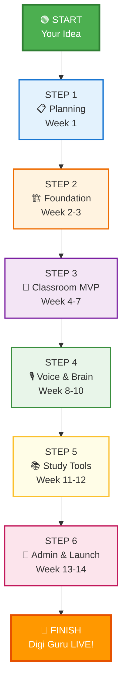
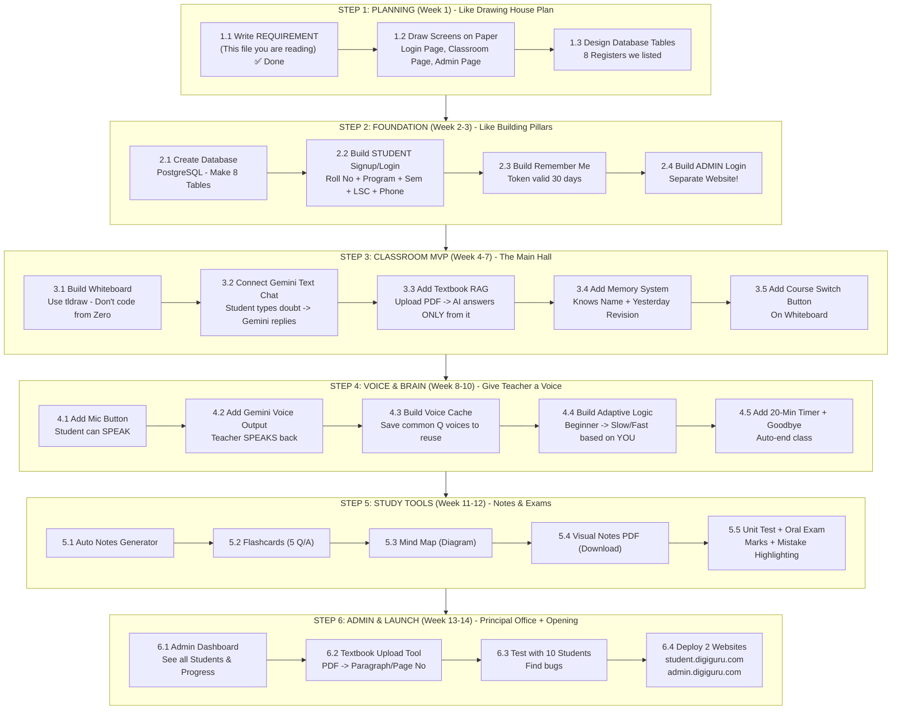
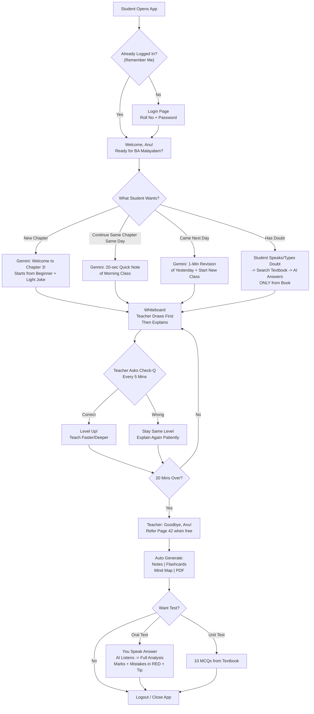
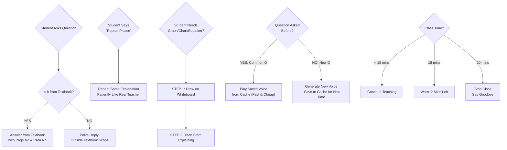

# DIGI GURU - STEP-BY-STEP ROADMAP
### Build it like LEGO - One Block at a Time
> **For +2 Students:** Just follow Step 1, then Step 2, then Step 3. Don't jump.

---

## TOTAL PICTURE - 6 PHASES IN 14 WEEKS



---

## DETAILED FLOWCHART - WHAT TO DO INSIDE EACH STEP



---

## SIMPLE TABLE ROADMAP - FOR YOUR NOTEBOOK

Copy this into your notebook. Tick each box when done.

### 🟦 STEP 1: PLANNING - WEEK 1 (Day 1 to Day 7)
| No | Task | Simple Meaning | Done? |
|----|------|----------------|-------|
| 1.1 | Finalize REQUIREMENT.md | This document is your bible | ✅ |
| 1.2 | Draw 5 Screens on Paper | Login, Signup, Classroom, Whiteboard, Admin Dashboard | ☐ |
| 1.3 | List All Database Tables | Write 8 table names on paper with columns | ☐ |
| 1.4 | Choose Technology | Next.js + Python FastAPI + PostgreSQL + Gemini | ☐ |
| 1.5 | Create GitHub Repo | Make 2 folders: `student-app` and `admin-app` | ☐ |

> **End of Week 1 Check:** Can you show your 5 paper sketches to a friend and they understand?

### 🟧 STEP 2: FOUNDATION - WEEK 2 & 3 (Day 8 to Day 21)
| No | Task | How to Do (Like Recipe) | Done? |
|----|------|-------------------------|-------|
| 2.1 | Setup Database | Install PostgreSQL. Create 8 empty tables. | ☐ |
| 2.2 | Student Signup Page | Form with 5 fields (Roll No, Program, Sem, LSC, Phone) + `Save to DB` | ☐ |
| 2.3 | Student Login Page | Roll No + Password check from DB | ☐ |
| 2.4 | Remember Me Logic | If ticked, save Token for 30 days using Cookie | ☐ |
| 2.5 | Admin Website (Separate!) | New project, new design, Login with Email/Password. NO link from Student app. | ☐ |
| 2.6 | Test | Create 3 fake students and try login/logout | ☐ |

> **Analogy:** Like building the foundation and walls of a house first. No painting yet.

### 🟪 STEP 3: CLASSROOM MVP - WEEK 4 to 7 (Day 22 to Day 49)
| No | Task | How to Do | Done? |
|----|------|-----------|-------|
| 3.1 | Whiteboard | Install `tldraw` package. Show empty whiteboard on screen. | ☐ |
| 3.2 | Text Chat with Gemini | Take student doubt (text) -> Send to Gemini API -> Show reply | ☐ |
| 3.3 | Textbook RAG (MOST IMPORTANT) | Upload 1 PDF (e.g., BA Malayalam Book) -> Split by Page No/Para No -> Store in Vector DB -> When doubt comes, search PDF and give only that text to Gemini | ☐ |
| 3.4 | Student Memory | On Login, fetch last class data from DB -> Send to Gemini as "This is Anu, he studied Chapter 2 yesterday" -> Gemini greets with name | ☐ |
| 3.5 | Revision Logic | Write `if` condition: `if last_class == yesterday => give 1-min revision` else if `same day same chapter => 20-sec revision` | ☐ |
| 3.6 | Course Switch | Add Dropdown Button on Whiteboard + Listen voice command "Change course to..." | ☐ |

> **Test:** Login as Anu (BA Malayalam, Sem 3). Ask "What is Chapter 2?". AI should reply ONLY from PDF + call you Anu.

### 🟩 STEP 4: VOICE & BRAIN - WEEK 8 to 10 (Day 50 to Day 70)
| No | Task | How to Do | Done? |
|----|------|-----------|-------|
| 4.1 | Mic Button | Add 🎤 button. Use `MediaRecorder` to record voice -> Send to Google Speech-to-Text | ☐ |
| 4.2 | Show "Listening..." | When student speaks, show wave animation (like WhatsApp recording) | ☐ |
| 4.3 | AI Voice Reply | Gemini generates text -> Send to Google Text-to-Speech -> Play audio on speaker | ☐ |
| 4.4 | Voice Cache | Create `voice_cache` table. Logic: `if question already exists in cache? Play saved file : Generate new and save` | ☐ |
| 4.5 | Adaptive Learning | Start everyone at Level 1. After each Q, if student correct -> Level++. If wrong -> stay Level 1. Change language difficulty based on level. | ☐ |
| 4.6 | 20-Min Timer | Show countdown timer top-right. At 18:00 show warning. At 20:00 auto-save and show "Goodbye" | ☐ |
| 4.7 | Smart Doubt Repeat | If student says "repeat please" -> Gemini repeats same explanation patiently | ☐ |

### 🟨 STEP 5: STUDY TOOLS - WEEK 11 & 12 (Day 71 to Day 84)
| No | Task | How to Do | Done? |
|----|------|-----------|-------|
| 5.1 | Notes Generator | After class, send transcript to Gemini: "Make summary notes" -> Save and show | ☐ |
| 5.2 | Flashcards | Prompt: "Make 5 Q/A flashcards from today's class" -> Show as flip cards | ☐ |
| 5.3 | Mind Map | Get JSON from Gemini -> Draw using `React Flow` (dots and lines diagram) | ☐ |
| 5.4 | PDF Export | Take Whiteboard Screenshot + Notes -> Use `jsPDF` library -> Generate `Anu_Chapter3_Notes.pdf` -> Download button | ☐ |
| 5.5 | Unit Test | After Chapter finish -> Generate 10 MCQs from textbook -> Student answers -> Show Score | ☐ |
| 5.6 | Oral Test (IMPORTANT) | Teacher asks Q by voice -> Student answers by voice -> Wait for full silence (1.5 sec) -> Analyze full answer -> Give Marks + Correct Answer + Mistakes in RED + Tip | ☐ |
| 5.7 | Chart/Graph Rule | When topic needs graph: Tool `draw_graph()` -> Draw on whiteboard FIRST -> THEN Gemini starts explaining | ☐ |

### 🟥 STEP 6: ADMIN & LAUNCH - WEEK 13 & 14 (Day 85 to Day 98)
| No | Task | How to Do | Done? |
|----|------|-----------|-------|
| 6.1 | Admin - View Students | Table: Roll No, Name, Program, Sem, LSC, Progress %, Last Login | ☐ |
| 6.2 | Admin - Upload Textbook | Button: Upload PDF -> Backend splits into Paragraph/Page No -> Store in Vector DB | ☐ |
| 6.3 | Admin - Analytics | Graph: How many students studied today, voice cache saved how much money | ☐ |
| 6.4 | Testing Phase | Give to 10 real students, note all bugs, fix them | ☐ |
| 6.5 | Deploy Student App | Host on `student.digiguru.com` (Vercel / Hostinger) | ☐ |
| 6.6 | Deploy Admin App | Host on `admin.digiguru.com` (DIFFERENT domain) | ☐ |
| 6.7 | Final Security Check | Make sure student can NEVER guess or access admin URL by typing /admin | ☐ |

---

## STUDENT JOURNEY FLOWCHART - HOW A STUDENT USES THE APP DAILY



---

## DECISION FLOWCHART - WHEN TO DO WHAT?



---

## FILE & FOLDER STRUCTURE - WHERE TO PUT CODE?

```
Digi-Guru/
│
├── student-app/                  <-- WEBSITE 1: For Students Only
│   ├── pages/
│   │   ├── signup.js             (Roll No, Program, Sem, LSC, Phone)
│   │   ├── login.js              (Roll No + Password + Remember Me)
│   │   └── classroom.js          (Whiteboard + AI Chat + Mic)
│   └── components/
│       ├── Whiteboard.jsx        (tldraw)
│       └── VoiceRecorder.jsx     (Mic button)
│
├── admin-app/                    <-- WEBSITE 2: For Admin Only (SEPARATE!)
│   ├── pages/
│   │   ├── login.js              (Email + Password)
│   │   └── dashboard.js          (View Students, Upload PDF)
│   └── components/
│       └── TextbookUploader.jsx
│
├── backend-api/                  <-- THE WAITER (Connects Everything)
│   ├── auth/                     (Login/Signup logic)
│   ├── gemini/                   (AI Teacher logic)
│   ├── rag/                      (Textbook Search logic)
│   └── voice-cache/              (Saved Voices)
│
└── database/                     <-- 8 Registers
    ├── students table
    ├── textbooks (Vector DB)
    └── ... (other 6 tables)
```

---

## WEEKLY CHECKLIST - PRINT THIS AND STICK ON WALL

```
WEEK 1  [ ] Planning & Paper Sketches
WEEK 2  [ ] Database Created
WEEK 3  [ ] Student + Admin Login Working
WEEK 4  [ ] Whiteboard Visible
WEEK 5  [ ] Gemini Chat Working (Text Only)
WEEK 6  [ ] Textbook PDF Upload + RAG Working
WEEK 7  [ ] Memory + Revision Logic Working
WEEK 8  [ ] Mic + Voice Working
WEEK 9  [ ] Voice Cache + Adaptive Level
WEEK 10 [ ] 20-Min Timer + Goodbye
WEEK 11 [ ] Notes, Flashcards, Mind Map, PDF
WEEK 12 [ ] Unit Test + Oral Test
WEEK 13 [ ] Admin Dashboard Full
WEEK 14 [ ] Testing + Deploy LIVE!
```

---

## GOLDEN RULES - NEVER FORGET (Like Traffic Rules)

1.  **Admin is INVISIBLE to Student** - Two websites, never one.
2.  **Textbook is GOD** - AI never answers outside it.
3.  **Graph FIRST, Explain LATER** - Always draw before talking.
4.  **Listen FULLY before Marking** - Wait for student to fully finish speaking.
5.  **Always say Goodbye** - Every class ends with Goodbye.
6.  **Roll Number = Identity** - Everything is linked to Roll No, not Name.
7.  **One Student = One World** - Data never mixes.

---

**Made for:** Digi Guru Project
**Date:** 09 Sep 2026
**Folder:** D:\Digi Guru-Sep-2026
**Next Step:** Show this ROADMAP.md to your developer. They will understand exactly what to build day-by-day.
